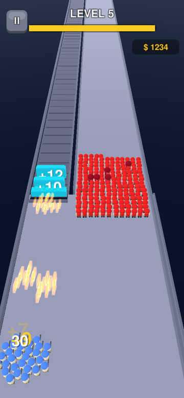
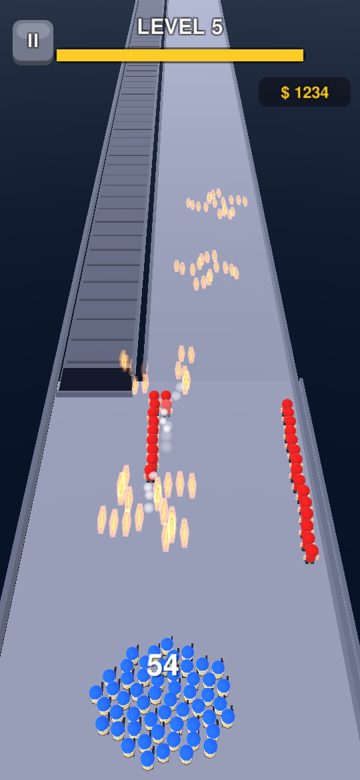
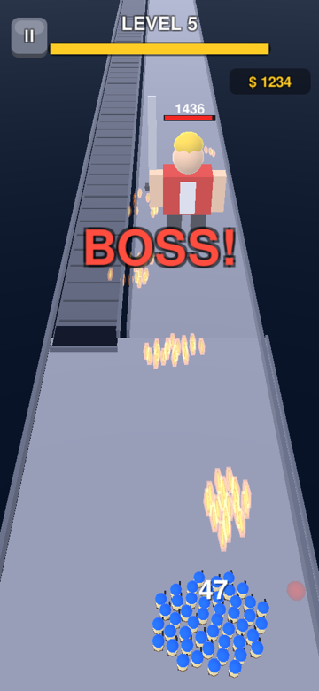

# Plasma — Squad vs Horde

<p align="center">  </p>

## بالعربية

**بلازما** لعبة أندرويد بمستويات لا نهائية. تتحكم بفرقة جنود تطلق النار تلقائياً:
- **اسحب يساراً** لتطلق على بوابات الأرقام (+1، +5، +99…) فتكبر فرقتك.
- **اسحب يميناً** لتوقف الحشد الأحمر قبل أن يصل إليك.
- في نهاية كل مستوى زعيم، وكل خامس مستوى زعيم عملاق.
- اجمع العملات وطوّر: قوة النار، سرعة الإطلاق، جنود البداية، مكافأة البوابات.
- يوجد أيضاً وضع **بلا نهاية** (Endless) بموجات تزداد صعوبة.

الحالة: **v0.1.0** نسخة أولى قابلة للعب (APK للتجربة). خطة التطوير في [`docs/ROADMAP.md`](docs/ROADMAP.md)، وتصميم اللعبة في [`docs/GDD.md`](docs/GDD.md)، والمستويات والصعوبة في [`docs/LEVELS.md`](docs/LEVELS.md).
**للمطورين ولوكلاء الذكاء الاصطناعي:** ابدأ بقراءة [`AGENTS.md`](AGENTS.md).

## English

**Plasma** is an infinite-level Android shooter. Your squad fires automatically: drag left to shoot
number gates and grow, drag right to stop the red horde, beat the boss at the end of every level
(a giant one every 5th level). Spend coins on four upgrades. Endless mode chains harder waves.

* Engine: Unity 2022.3.62f3 LTS, built-in RP, Android (IL2CPP, ARM64 + ARMv7, min SDK 24, target 36)
* No imported assets — procedural meshes, synthesised audio, GPU instancing for thousands of units
* Gameplay is a deterministic engine-free C# simulation with a bot player → balance is tested headless in seconds

| Doc | Content |
|---|---|
| [`AGENTS.md`](AGENTS.md) | Handover: repo map, setup from zero, build/test commands, conventions, next tasks |
| [`docs/GDD.md`](docs/GDD.md) | Game design |
| [`docs/LEVELS.md`](docs/LEVELS.md) | Level generator formulas, difficulty curve, balance sweep results |
| [`docs/ROADMAP.md`](docs/ROADMAP.md) | Milestones to store launch and beyond |
| [`docs/TESTING.md`](docs/TESTING.md) | Simulation, compile, rendered capture, device checklist |
| [`docs/ART_AUDIO.md`](docs/ART_AUDIO.md) · [`docs/STORE.md`](docs/STORE.md) | Art/audio direction · store & monetisation |

Quick start (Linux sandbox, no GPU):
```bash
tools/sandbox/setup_unity.sh                     # install Unity + Android toolchain
tools/simharness/run.sh 100 0.45                 # balance sweep (no Unity needed)
tools/sandbox/unity.sh BuildAndroid Android      # → Builds/Plasma.apk
```
Gameplay video: [`docs/media/gameplay_v0.1.0.mp4`](docs/media/gameplay_v0.1.0.mp4)

© 2026 Ayoub Teke. All rights reserved.
