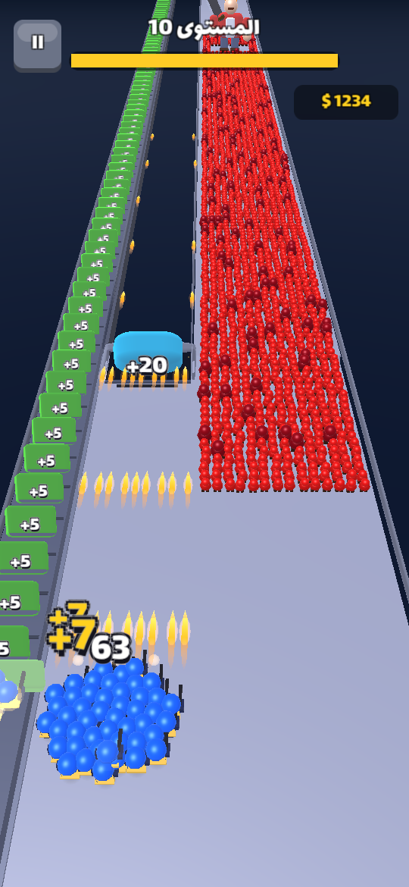
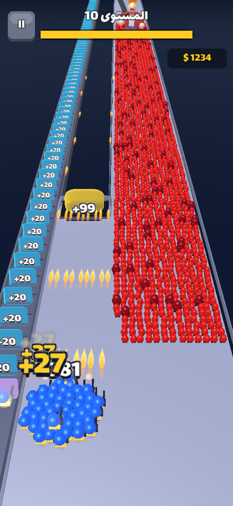
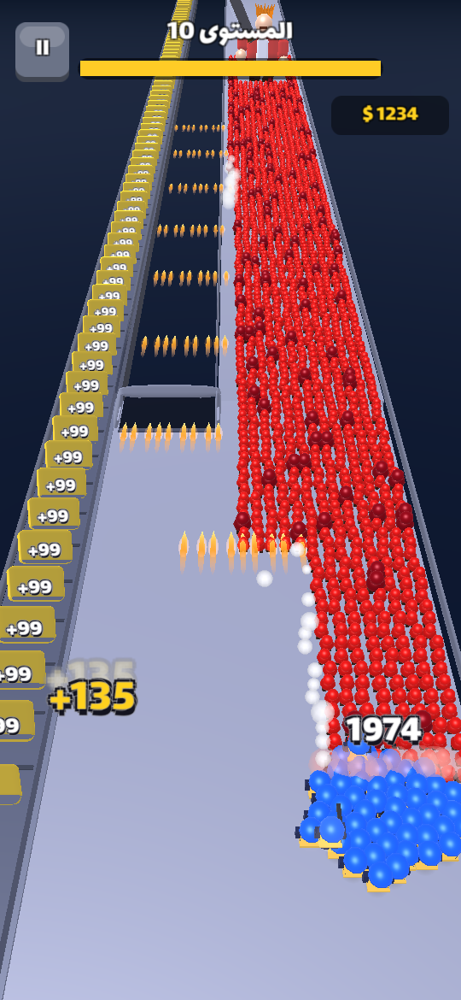
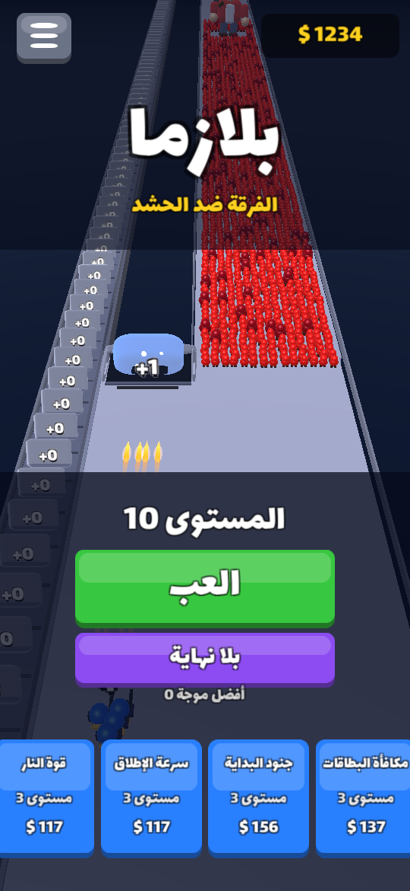

# Plasma — Squad vs Horde

<p align="center">   </p>

## بالعربية

**بلازما** لعبة أندرويد بمستويات لا نهائية، مبنية على آلية فيديو الإعلان المرجعي (`docs/reference/`). فرقتك تطلق النار تلقائياً، وأنت تسحبها يميناً ويساراً فقط:
- **البوابة المنتفخة** في أعلى الساحة: أطلق عليها حتى تنفجر، فتتحول كل بطاقات **الشريط** إلى قيمتها (+0 ← +1 ← +5 ← … ← +99).
- **الشريط** على اليسار يحمل بطاقات "+N" نحوك: قف عند نهايته لتجمعها، فتكبر فرقتك.
- **الحشد الأحمر** يزحف على اليمين ومعه **زعيم** بسيف ضخم: أوقفه قبل أن يصل إليك. كل خامس مستوى زعيم عملاق.
- 4 ترقيات دائمة، ووضع **بلا نهاية**، وواجهة **عربية وإنجليزية**، وإعدادات للأصوات والموسيقى والاهتزاز، وشرح تفاعلي في أول مستويين.

الحالة: **v0.2.0** (نسخة تجريبية APK). خطة التطوير في [`docs/ROADMAP.md`](docs/ROADMAP.md)، وتصميم اللعبة في [`docs/GDD.md`](docs/GDD.md)، والمستويات والصعوبة في [`docs/LEVELS.md`](docs/LEVELS.md).
**للمطورين ولوكلاء الذكاء الاصطناعي:** ابدأ بقراءة [`AGENTS.md`](AGENTS.md).

## English

**Plasma** is an infinite-level Android shooter that reproduces the mechanic of the reference ad
(`docs/reference/`). Your squad fires automatically; you only slide it. Shoot the **upgrade gate** to turn
every tile on the **conveyor** into +1, +5 … +99, stand at the belt's end to **collect** tiles and grow,
and stop the **red horde** and the **boss** walking inside it. Four upgrades, Endless mode, Arabic + English UI.

* Engine: Unity 2022.3.62f3 LTS, built-in RP, Android (IL2CPP, ARM64 + ARMv7, min SDK 24, target 36)
* No imported assets except the OFL font Lalezar — procedural meshes, synthesised SFX + music, GPU instancing for thousands of units
* Gameplay is a deterministic engine-free C# simulation with a bot player → balance is tested headless in seconds

| Doc | Content |
|---|---|
| [`AGENTS.md`](AGENTS.md) | Handover: repo map, setup from zero, build/test commands, conventions, next tasks |
| [`docs/GDD.md`](docs/GDD.md) | Game design |
| [`docs/LEVELS.md`](docs/LEVELS.md) | Level generator formulas, difficulty curve, balance sweep results |
| [`docs/ROADMAP.md`](docs/ROADMAP.md) | Milestones to store launch and beyond |
| [`docs/TESTING.md`](docs/TESTING.md) | Simulation, compile, rendered capture, device checklist |
| [`docs/ART_AUDIO.md`](docs/ART_AUDIO.md) · [`docs/STORE.md`](docs/STORE.md) | Art/audio direction + licence log · store & monetisation |
| [`docs/reference/`](docs/reference/) | The reference ad video + frame analysis |

Quick start (Linux sandbox, no GPU):
```bash
tools/sandbox/setup_unity.sh                     # install Unity + Android toolchain
tools/simharness/run.sh 100 0.3                  # balance sweep (no Unity needed)
tools/sandbox/unity.sh BuildAndroid Android      # → Builds/Plasma.apk
```
Gameplay videos: [`docs/media/gameplay_v0.2.0_ar_level10.mp4`](docs/media/gameplay_v0.2.0_ar_level10.mp4) (Arabic UI, boss level) ·
[`docs/media/gameplay_v0.2.0_en_level1.mp4`](docs/media/gameplay_v0.2.0_en_level1.mp4) (English UI, level 1 with tutorial hints)

© 2026 Ayoub Teke. All rights reserved. Font Lalezar © The Lalezar Project Authors, SIL OFL 1.1.
